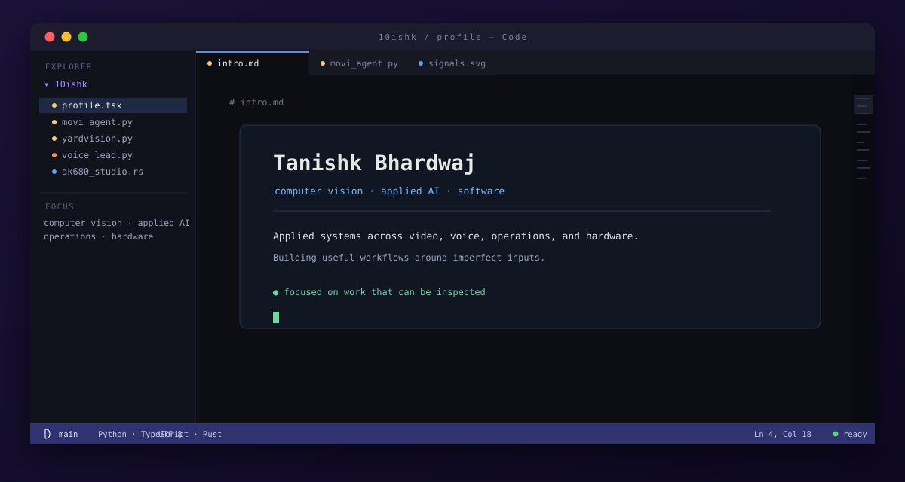

  

  <a href="https://tanishk.net">tanishk.net</a> ·
  <a href="https://www.linkedin.com/in/tanishk004">LinkedIn</a> ·
  <a href="https://github.com/10ishk">GitHub</a>

 

## stack.orbit

  

 

## projects/

  

<strong>movi-agent</strong> · <code>react</code> <code>typescript</code> <code>fastapi</code>

Full-stack transport operations copilot: natural-language trip and route workflows with fuzzy matching, guarded vehicle actions, and human confirmation before consequential changes.

**Stack:** React, TypeScript, FastAPI, Express, SQLite 
**Repo:** [10ishk/movi-agent](https://github.com/10ishk/movi-agent)

<strong>yardvision-sop-monitoring</strong> · <code>python</code> <code>opencv</code> <code>yolov8</code>

Object-level logistics vision that turns camera feeds into SOP events, ROI-zone alerts, evidence snapshots, compliance review, and operational dashboards.

**Stack:** Python, OpenCV, YOLOv8, Streamlit, SQLite 
**Repo:** [10ishk/yardvision-sop-monitoring](https://github.com/10ishk/yardvision-sop-monitoring)

<strong>voice-lead-agent</strong> · <code>python</code> <code>vapi</code> <code>deepgram</code>

Permission-first multilingual voice qualification with grounded project facts, state-aware conversations, explainable outcomes, and typed post-call summaries.

**Stack:** Python, YAML, Pydantic, Vapi, Deepgram 
**Repo:** [10ishk/voice-lead-agent](https://github.com/10ishk/voice-lead-agent)

<strong>ak680-studio</strong> · <code>tauri</code> <code>rust</code> <code>hid</code>

Native AK680 V2 profile inspector and configurator with local profile workflows, HID device detection, lighting controls, and mapped Rapid Trigger writes.

**Stack:** Tauri, React, TypeScript, Rust, HID 
**Repo:** [10ishk/ak680-studio](https://github.com/10ishk/ak680-studio)

<strong>ak680-overlay-studio</strong> · <code>electron</code> <code>react</code> <code>typescript</code>

Electron overlay controller for the official AJAZZ web driver, with route and DOM adapters for lighting, performance, keymap, SOCD, macros, and settings workflows.

**Stack:** Electron, React, TypeScript, Vite 
**Repo:** [10ishk/ak680-overlay-studio](https://github.com/10ishk/ak680-overlay-studio)

<strong>cargo-visibility-control-tower</strong> · <code>python</code> <code>sqlite</code> <code>power-bi</code>

Shipment control tower for visibility, SLA breaches, exceptions, hub performance, and revenue-at-risk analysis, backed by a documented local BI workflow.

**Stack:** Python, SQLite, SQL, Power BI, Streamlit, Plotly 
**Repo:** [10ishk/cargo-visibility-control-tower](https://github.com/10ishk/cargo-visibility-control-tower)

<strong>port-yard-dispatch-optimizer</strong> · <code>python</code> <code>ortools</code> <code>fastapi</code>

Dispatch planning prototype with capacity checks, delivery windows, route cost, priority handling, SLA-risk scoring, and an OR-Tools solver with a deterministic fallback.

**Stack:** Python, OR-Tools, FastAPI, Streamlit, SQLite, Plotly 
**Repo:** [10ishk/port-yard-dispatch-optimizer](https://github.com/10ishk/port-yard-dispatch-optimizer)

<strong>tanishk-portfolio</strong> · <code>next.js</code> <code>react</code> <code>motion</code>

Motion-led editorial portfolio with project pages, notes, experience views, interactive canvas surfaces, and multiple home-page prototypes.

**Stack:** Next.js, React, TypeScript, Motion, GSAP, Playwright 
**Repo:** [10ishk/tanishk-portfolio](https://github.com/10ishk/tanishk-portfolio)

<strong>lstm-text-generator</strong> · <code>pytorch</code> <code>lstm</code> <code>nlp</code>

Reproducible word-level text generation pipeline covering data preparation, vocabulary handling, LSTM training, validation, and temperature-based sampling.

**Stack:** Python, PyTorch, LSTM, Jupyter, pytest 
**Repo:** [10ishk/lstm-text-generator](https://github.com/10ishk/lstm-text-generator)

<strong>CallSense-App</strong> · <code>python</code> <code>whisper</code> <code>nlp</code>

Call intelligence pipeline that transcribes audio, summarizes conversations, classifies emotion, estimates urgency, extracts actions, and exports structured reports.

**Stack:** Python, Whisper, Transformers, Streamlit, CSV, JSON 
**Repo:** [10ishk/CallSense-App](https://github.com/10ishk/CallSense-App)

<strong>AdverseWeatherAVDetection</strong> · <code>python</code> <code>yolov5</code> <code>computer-vision</code>

Vehicle detection under rain, fog, and snow using an adverse-weather BDD100K subset, YOLO annotation conversion, transfer learning, and recorded evaluation metrics.

**Stack:** Python, YOLOv5, PyTorch, BDD100K, Jupyter 
**Repo:** [10ishk/AdverseWeatherAVDetection](https://github.com/10ishk/AdverseWeatherAVDetection)

<strong>archive</strong> · <em>older work</em>

- [ai_models](https://github.com/10ishk/ai_models) — classic ML notebooks covering regression, clustering, KNN, SVM, and decision trees
- [Face_recog](https://github.com/10ishk/Face_recog) — early computer-vision experimentation
- [Housing_analysis](https://github.com/10ishk/Housing_analysis) — exploratory data analysis and regression work

 

  <picture>
    <source media="(prefers-color-scheme: dark)" srcset="https://raw.githubusercontent.com/10ishk/10ishk/output/dist/snake-dark.svg">
    <source media="(prefers-color-scheme: light)" srcset="https://raw.githubusercontent.com/10ishk/10ishk/output/dist/snake.svg">
    
  </picture>

 

<a href="https://tanishk.net">tanishk.net</a> · <a href="https://www.linkedin.com/in/tanishk004">LinkedIn</a> · <a href="https://github.com/10ishk">GitHub</a>

