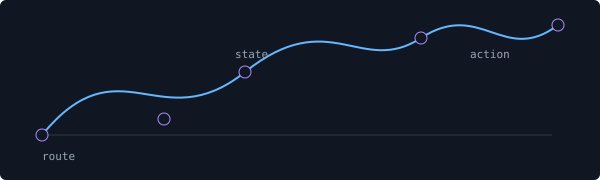
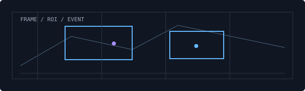
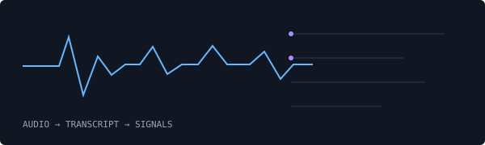
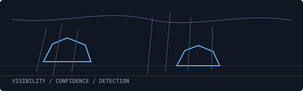

<h1 align="center">Tanishk Bhardwaj</h1>

computer vision · applied AI · software

<a href="https://tanishk.net">tanishk.net</a> · <a href="https://www.linkedin.com/in/tanishk004">LinkedIn</a> · <a href="https://github.com/10ishk">GitHub</a>

## Selected work

<table>
<tr>
<td width="50%" valign="top">

<h3><a href="https://github.com/10ishk/movi-agent">Movi</a></h3>

Transport operations through a conversational workflow. An admin interface connects to data, routing, entity resolution, and confirmation-aware actions.

React · TypeScript · FastAPI · Express · SQLite
</td>
<td width="50%" valign="top">

<h3><a href="https://github.com/10ishk/yardvision-sop-monitoring">YardVision</a></h3>

Video interpreted as logistics events. ROI zones, object detections, evidence snapshots, and SOP rules meet in a reviewable dashboard.

Python · OpenCV · YOLOv8 · Streamlit · SQLite
</td>
</tr>
<tr>
<td width="50%" valign="top">

<h3><a href="https://github.com/10ishk/CallSense-App">CallSense</a></h3>

Conversation turned into a compact report: transcription, summary, emotion, urgency, and follow-up actions for support review.

Python · PyTorch · Transformers · Whisper · Streamlit
</td>
<td width="50%" valign="top">

<h3><a href="https://github.com/10ishk/AdverseWeatherAVDetection">Adverse Weather Detection</a></h3>

A detection pipeline for degraded road scenes, with weather filtering, YOLO training, evaluation, and inference around vehicle perception.

Python · PyTorch · YOLOv5 · OpenCV · Jupyter
</td>
</tr>
</table>

## Currently

- Building computer vision systems that turn imperfect inputs into events people can act on.
- Exploring operational software where model output is part of a larger workflow.
- Keeping a human decision point in the loop when an action has consequences.

## Notes

I’m interested in the boundary between perception and application logic: when video should become structured data, when a system should ask before acting, and how to make applied models easier to inspect when the input is noisy.

## Tools

`Python` · `TypeScript` · `PyTorch` · `OpenCV` · `FastAPI` · `SQL` · `React` · `Docker`

## Elsewhere

[tanishk.net](https://tanishk.net) · [LinkedIn](https://www.linkedin.com/in/tanishk004) · [GitHub](https://github.com/10ishk)
