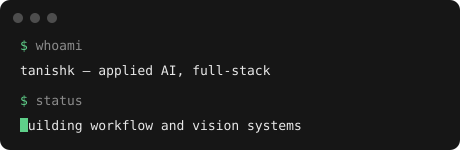

<h1 align="center">Tanishk Bhardwaj</h1>

  

  <a href="https://tanishk.net">tanishk.net</a> ·
  <a href="https://www.linkedin.com/in/tanishk004">LinkedIn</a> ·
  <a href="https://github.com/10ishk">GitHub</a>

  I build applied systems across video, voice, operations software, and desktop hardware.

 

  

**Currently:**
- Building workflow systems that require confirmation before consequential actions
- Working on computer-vision pipelines for degraded visibility and operational camera feeds
- Open to applied AI / full-stack roles and collaborations

 

 

## Featured

<h3> <a href="https://github.com/10ishk/movi-agent">Movi</a></h3>
AI-assisted transport operations: natural-language workflows for trips and routes, with entity matching and confirmation before consequential actions.
 <code>React</code> <code>TypeScript</code> <code>FastAPI</code> <code>Express</code> <code>SQLite</code>

<h3> <a href="https://github.com/10ishk/yardvision-sop-monitoring">YardVision</a></h3>
Logistics camera feeds turned into object-level SOP events, evidence snapshots, ROI zones, and safety alerts.
 <code>Python</code> <code>OpenCV</code> <code>YOLOv8</code> <code>Streamlit</code>

<h3> <a href="https://github.com/10ishk/voice-lead-agent">VoiceLead</a></h3>
State-aware voice qualification grounded in project facts, with English, Hindi, Hinglish, and typed post-call outcomes.
 <code>Python</code> <code>YAML</code> <code>Pydantic</code> <code>Vapi</code> <code>Deepgram</code>

<h3> <a href="https://github.com/10ishk/ak680-studio">AK680 Studio</a></h3>
Native desktop software for the AJAZZ AK680 V2, covering profiles, device detection, lighting, and Rapid Trigger controls over its hardware interfaces.
 <code>Tauri</code> <code>React</code> <code>TypeScript</code> <code>Rust</code> <code>HID</code>

 

## More work

| Project | What it does | Stack |
| --- | --- | --- |
| [Port Yard Dispatch Optimizer](https://github.com/10ishk/port-yard-dispatch-optimizer) | Vehicle routing under capacity, time-window, and SLA constraints | `Python` |
| [Adverse Weather Detection](https://github.com/10ishk/AdverseWeatherAVDetection) | Vehicle perception through rain, fog, and snow | `Python` `OpenCV` |
| [CallSense](https://github.com/10ishk/CallSense-App) | Transcription, emotion, urgency, and action extraction from calls | `Python` `PyTorch` |

 

  <picture>
    <source media="(prefers-color-scheme: dark)" srcset="https://raw.githubusercontent.com/10ishk/10ishk/output/dist/snake-dark.svg">
    <source media="(prefers-color-scheme: light)" srcset="https://raw.githubusercontent.com/10ishk/10ishk/output/dist/snake.svg">
    
  </picture>

 

<a href="https://tanishk.net">tanishk.net</a> · <a href="https://www.linkedin.com/in/tanishk004">LinkedIn</a> · <a href="https://github.com/10ishk">GitHub</a>

