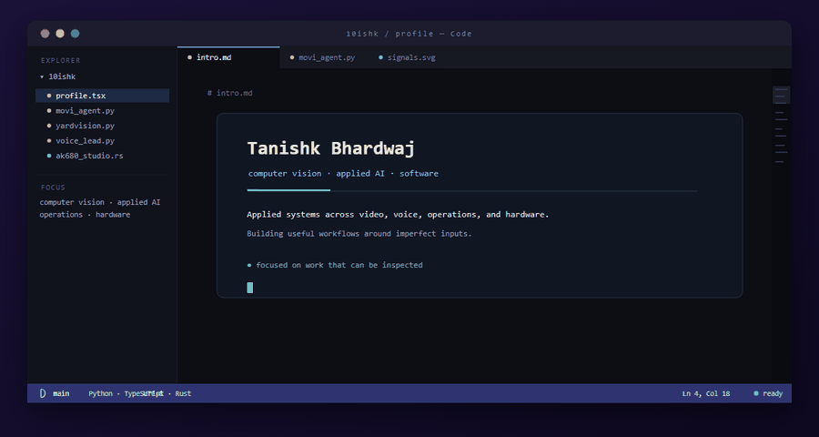
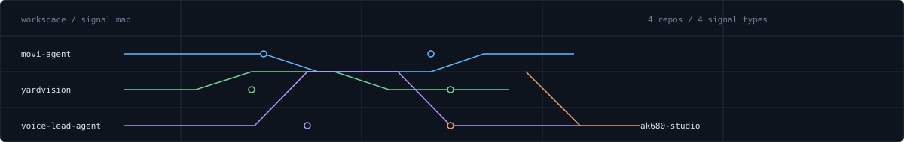

<p align="center">
  
</p>

<p align="center">
  
</p>

<p align="center"><a href="https://tanishk.net">tanishk.net</a> · <a href="https://www.linkedin.com/in/tanishk004">LinkedIn</a> · <a href="https://github.com/10ishk">GitHub</a></p>

<br>

## stack.json

```json
{
  "languages": ["Python", "TypeScript", "Rust"],
  "frontend": ["React"],
  "backend": ["FastAPI", "Express", "SQLite"],
  "ml_cv": ["PyTorch", "OpenCV", "YOLOv8"],
  "desktop": ["Tauri"]
}
```

<br>



## projects/

<details open>
<summary><strong>movi-agent</strong> · <code>react</code> <code>typescript</code> <code>fastapi</code></summary>

AI-assisted transport operations: natural-language workflows for trips and routes, with entity matching and confirmation before consequential actions.

**Stack:** React, TypeScript, FastAPI, Express, SQLite<br>
**Repo:** [10ishk/movi-agent](https://github.com/10ishk/movi-agent)

</details>

<details>
<summary><strong>yardvision-sop-monitoring</strong> · <code>python</code> <code>opencv</code> <code>yolov8</code></summary>

Logistics camera feeds turned into object-level SOP events, evidence snapshots, ROI zones, and safety alerts.

**Stack:** Python, OpenCV, YOLOv8, Streamlit<br>
**Repo:** [10ishk/yardvision-sop-monitoring](https://github.com/10ishk/yardvision-sop-monitoring)

</details>

<details>
<summary><strong>voice-lead-agent</strong> · <code>python</code> <code>vapi</code> <code>deepgram</code></summary>

State-aware voice qualification grounded in project facts, with English, Hindi, Hinglish, and typed post-call outcomes.

**Stack:** Python, YAML, Pydantic, Vapi, Deepgram<br>
**Repo:** [10ishk/voice-lead-agent](https://github.com/10ishk/voice-lead-agent)

</details>

<details>
<summary><strong>ak680-studio</strong> · <code>tauri</code> <code>rust</code> <code>hid</code></summary>

Native desktop software for the AJAZZ AK680 V2, covering profiles, device detection, lighting, and Rapid Trigger controls over its hardware interfaces.

**Stack:** Tauri, React, TypeScript, Rust, HID<br>
**Repo:** [10ishk/ak680-studio](https://github.com/10ishk/ak680-studio)

</details>

<details>
<summary><strong>archive</strong> · <em>more work</em></summary>

- [Port Yard Dispatch Optimizer](https://github.com/10ishk/port-yard-dispatch-optimizer) — vehicle routing under capacity, time-window, and SLA constraints
- [Adverse Weather Detection](https://github.com/10ishk/AdverseWeatherAVDetection) — vehicle perception through rain, fog, and snow
- [CallSense](https://github.com/10ishk/CallSense-App) — transcription, emotion, urgency, and action extraction from calls

</details>

<br>

<p align="center">
  <picture>
    <source media="(prefers-color-scheme: dark)" srcset="https://raw.githubusercontent.com/10ishk/10ishk/output/dist/snake-dark.svg">
    <source media="(prefers-color-scheme: light)" srcset="https://raw.githubusercontent.com/10ishk/10ishk/output/dist/snake.svg">
    
  </picture>
</p>

<br>

<p align="center"><sub><a href="https://tanishk.net">tanishk.net</a> · <a href="https://www.linkedin.com/in/tanishk004">LinkedIn</a> · <a href="https://github.com/10ishk">GitHub</a></sub></p>
