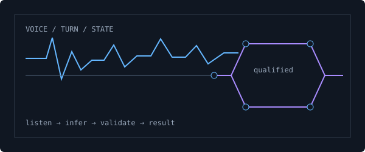
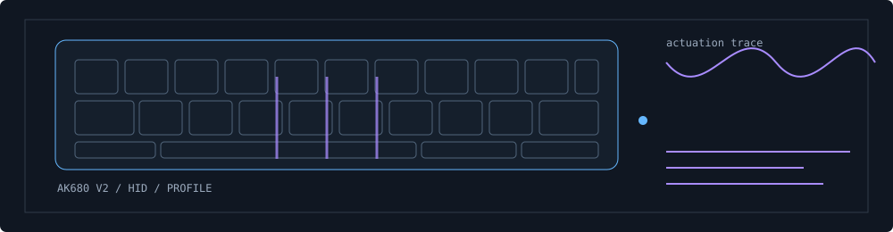
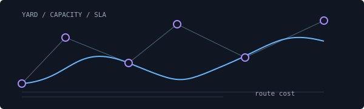

## Selected work

<h2><a href="https://github.com/10ishk/movi-agent">Movi</a></h2>

AI-assisted transport operations with routes, trips, natural-language workflows and confirmation-aware actions.

React · TypeScript · FastAPI · Express · SQLite

 

<table>
<tr>
<td width="50%" valign="top">

<h2><a href="https://github.com/10ishk/yardvision-sop-monitoring">YardVision</a></h2>

Logistics video translated into object-level SOP events, evidence snapshots and safety alerts.

Python · OpenCV · YOLOv8 · Streamlit
</td>
<td width="50%" valign="top">

<h2><a href="https://github.com/10ishk/voice-lead-agent">VoiceLead</a></h2>

State-aware voice qualification with grounded project facts, English, Hindi and Hinglish behaviour, and typed post-call outcomes.

Python · YAML · Pydantic · Vapi · Deepgram
</td>
</tr>
</table>

<h2><a href="https://github.com/10ishk/ak680-studio">AK680 Studio</a></h2>

A native desktop configurator for the AJAZZ AK680 V2, spanning profiles, device detection, lighting and Rapid Trigger controls.

Tauri · React · TypeScript · Rust · HID

## More work

<table>
<tr>
<td width="33%" valign="top"> <strong><a href="https://github.com/10ishk/port-yard-dispatch-optimizer">Port Yard Dispatch Optimizer</a></strong> Vehicle routing, capacity, time windows and SLA risk.</td>
<td width="33%" valign="top"> <strong><a href="https://github.com/10ishk/AdverseWeatherAVDetection">Adverse Weather Detection</a></strong> Vehicle perception under rain, fog and snow.</td>
<td width="33%" valign="top"> <strong><a href="https://github.com/10ishk/CallSense-App">CallSense</a></strong> Transcription, emotion, urgency and action extraction.</td>
</tr>
</table>

 

<a href="https://tanishk.net">tanishk.net</a> · <a href="https://www.linkedin.com/in/tanishk004">LinkedIn</a> · <a href="https://github.com/10ishk">GitHub</a>

